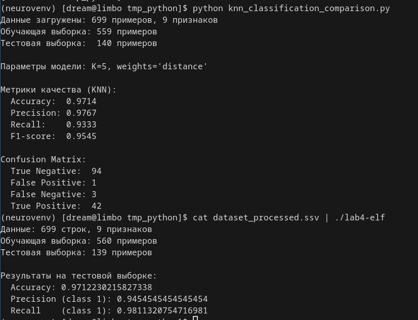
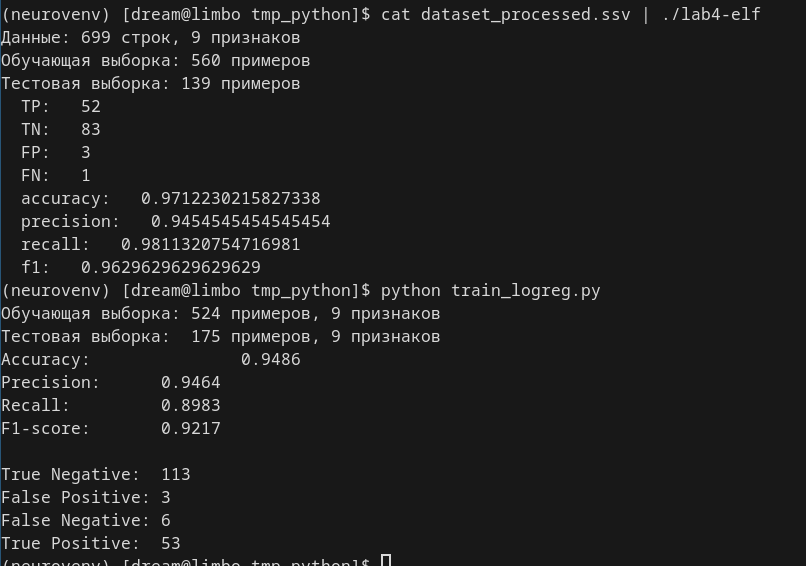
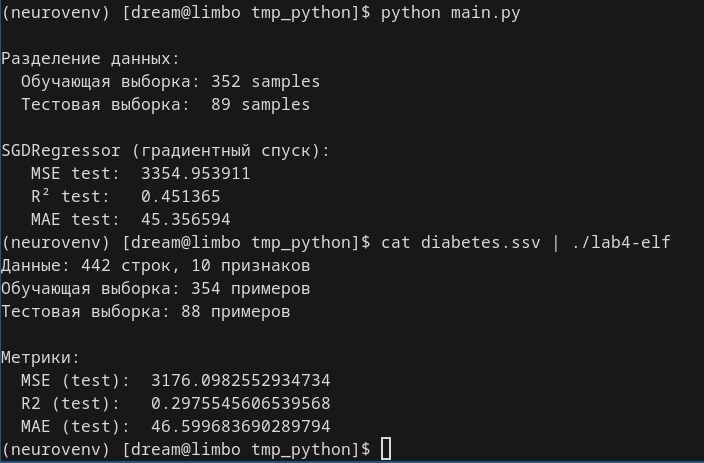
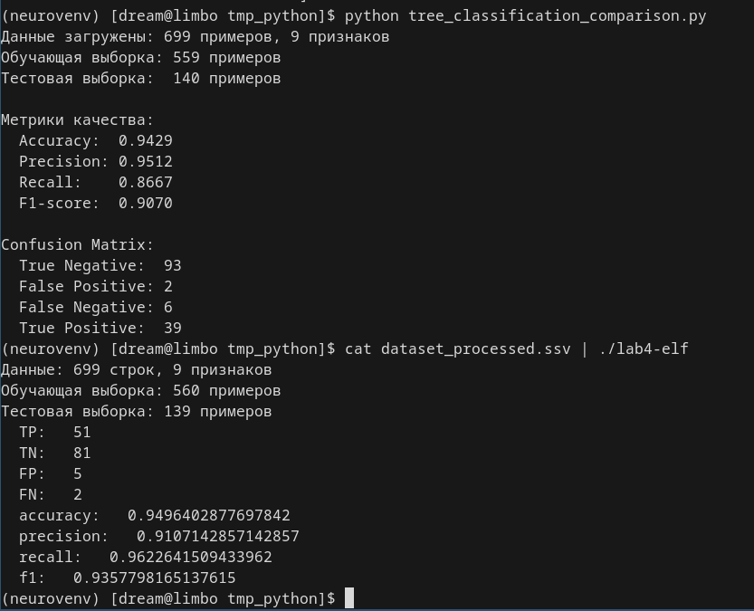
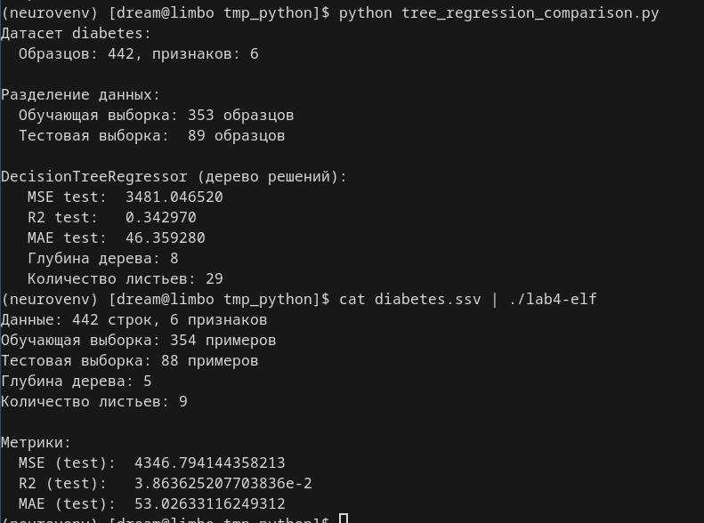

# Лабораторная работа 4
 - Выполнили: Дмитриев Денис Сергеевич, Думцев Виктор Сергеевич
 - Группа: P3312

# HaskLearn
В этой лабораторной работе мы реализовали на Haskell методы классического машинного обучения - линейную регрессию, логистическую регрессию, k ближайших соседей и решающее дерево, а также метрики для регрессии и классификации. Кроме того было проведено сравнение наших методов с таковыми в sklearn. 

## Модули
Основными модулями являются файлы из папки HaskLearn/Models. Кроме них реализован Processing.hs с методом разделения выборки на обучающую и тестовую, Metrics.hs с метриками и Types.hs с основными типами. Также для целей тестирования был создан модуль Main.hs принимающий из stdin датасет в формате SSV(Semicolon Separated Values), производящий разделение выборки, обучение выбранной модели и рассчёт метрик на тестовой выборке.

## Сравнение с Sklearn

### KNN

Классификация через KNN совпадает по метрикам с sklearn с точностью до рандома в разделении данных.

### Logreg

Классификация через логистическую регрессию чуть хуже таковой из Sklearn, объясняется это применением алгоритма liblinear(координатныый спуск) градиентного спуска в Sklearn.

### Linreg

Регрессия через линейную регрессию тоже чуть хуже SKlearn'овской, объясняется использованием стохастического градиентного спуска(через мини-батчи) в sklearn.

### Tree classification

Классификация через дерево совпадает с точностью до рандома.

### Tree Regression

И наша регрессия, и Sklearn показывают плохие результаты на датасете, но наша имеет более плохие метрики чем Sklearn. Обусловлено тем что в Sklearn имеются дополнительные гиперпараметры предотвращающие переобучение дерева на критерии MSE.

## Вывод
В процессе работы над лабой мы получили опыт реализации методов ML на хаскель. Основной вывод который мы вынесли из работы над проектом - хаскель очень интересен своей ленивостью вычислений и формализмом, но из-за чистых функций и иммутабельности в нём бывает очень сложно делать те практические вещи, которые в императивных языках делаются в одну строку. Каждому - своё, и хаскель для промышленной разработки пакетов машинного обучения не особо подходит.